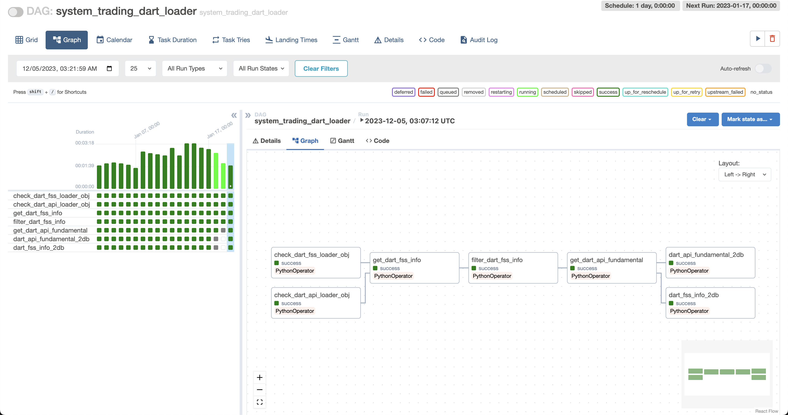

# Data-Pipline

## Based on Airflow

```
.
├── dags
│   ├── system_trading
│   │   ├── dart.py
│   │   ├── fdr.py
│   │   └── pykrx.py
├── plugins
│   └── system_trading
│       ├── __init__.py
│       ├── api_loader
│       │   ├── __init__.py
│       │   ├── dart.py
│       │   ├── fdr.py
│       │   ├── private.py
│       │   └── pykrx.py
│       └── controller
│           ├── __init__.py
│           ├── db.py
│           └── private.py

~/airflow (tree)
```

### Dart

- dart
    - general info
    - fundamental data
### Finance_Data_Reader

- fdr
    - general info
    - ohlcv

### pykrx

- pykrx
    - trader 
        - foreign trade
        - corporation trade
        - individual trade